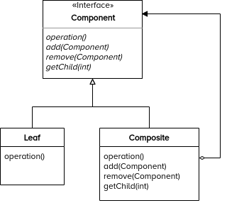

# Design Principles and Patterns

- [Design Principles and Patterns](#design-principles-and-patterns)
  - [Single Responsibility Principle (SRP)](#single-responsibility-principle-srp)
    - [SRP Examples](#srp-examples)
  - [Open-Closed Principle (OCP)](#open-closed-principle-ocp)
    - [OCP Examples](#ocp-examples)
  - [Liskov Substitution Principle (LSP)](#liskov-substitution-principle-lsp)
    - [LSP Examples](#lsp-examples)
  - [Interface Segregation Principle (ISP)](#interface-segregation-principle-isp)
    - [ISP Examples](#isp-examples)
  - [Dependency Inversion Principle (DIP)](#dependency-inversion-principle-dip)
    - [DIP Examples](#dip-examples)
  - [Builder](#builder)
    - [Builder Examples](#builder-examples)
  - [Factory](#factory)
    - [Factory Examples](#factory-examples)
  - [Prototype](#prototype)
    - [Prototype Examples](#prototype-examples)
  - [Singleton](#singleton)
    - [Singleton Examples](#singleton-examples)
  - [Adapter](#adapter)
    - [Adapter Examples](#adapter-examples)
  - [Bridge](#bridge)
    - [Bridge Examples](#bridge-examples)
  - [Composite](#composite)
    - [Intent](#intent)
    - [Motivation](#motivation)
    - [Applicability](#applicability)
    - [Structure](#structure)
    - [Participants](#participants)
    - [Collaborations](#collaborations)
    - [Consequences](#consequences)
    - [Implementation](#implementation)
    - [Related Patterns](#related-patterns)
    - [Examples](#examples)
  - [Sources](#sources)

## Single Responsibility Principle (SRP)

A class should have only 1 reason to change. Responsibility implies a reason for change.

### SRP Examples

Python:

- [`srp_violate.py`](python/src/srp/srp_violate.py)
- [`srp_comply.py`](python/src/srp/srp_comply.py)
- [`srp_test.py`](python/src/srp/srp_test.py)

## Open-Closed Principle (OCP)

Software entities (classes, modules, functions, etc.) should be open for extension, but closed for modification.

### OCP Examples

Python:

- [`ocp_violate.py`](python/src/ocp/ocp_violate.py)
- [`ocp_comply.py`](python/src/ocp/ocp_comply.py)
- [`ocp_test.py`](python/src/ocp/ocp_test.py)

## Liskov Substitution Principle (LSP)

Subtypes must be substitutable for their base types.

### LSP Examples

Python:

- [`lsp_test.py`](python/src/lsp/lsp_test.py)

## Interface Segregation Principle (ISP)

Clients should not be forced to depend on methods that they do not use.

### ISP Examples

Python:

- [`isp_violate.py`](python/src/isp/isp_violate.py)
- [`isp_comply.py`](python/src/isp/isp_comply.py)
- [`isp_test.py`](python/src/isp/isp_test.py)

## Dependency Inversion Principle (DIP)

High-level modules should not depend on low-level modules. Both should depend on abstractions. Abstractions should not depend on details. Details should depend on abstractions.

### DIP Examples

Python:

- [`dip_violate.py`](python/src/dip/dip_violate.py)
- [`dip_comply.py`](python/src/dip/dip_comply.py)
- [`dip_test.py`](python/src/dip/dip_test.py)

## Builder

- When piecewise object construction is complicated, provide an API for doing it succinctly
- Motivation
  - some objects are simple and can be created in a single initialiser call
  - other objects require a lot of ceremony to create
  - having an object with 10 initialiser arguments is not productive
    - instead, opt of piecewise construction
  - Builder provides an API for constructing an object step-by-step

### Builder Examples

Python:

- [`builder.py`](python/src/builder/builder.py)
- [`builder_test.py`](python/src/builder/builder_test.py)
- [`builder_facets.py`](python/src/builder/builder_facets.py)
- [`builder_facets_test.py`](python/src/builder/builder_facets_test.py)
- [`builder_inheritance.py`](python/src/builder/builder_inheritance.py)
- [`builder_inheritance_test.py`](python/src/builder/builder_inheritance_test.py)

## Factory

- Motivation
  - object creation logic becomes too convoluted
  - initialiser is not descriptive
    - cannot overload with the same sets of arguments with different names
    - can turn into 'optional parameter hell'
- Wholesale object creation (not piecewise like Builder) can be outsourced to:
  - a separate method (Factory Method)
    - a static method that creates objects
  - a separate class (Factory)
    - any entity that can take care of object creation
  - a hierarchy of factories (Abstract Factory)
    - correspond to a hierarchy of types

### Factory Examples

Python:

- [`factory_method.py`](python/src/factory/factory_method.py)
- [`factory_method_test.py`](python/src/factory/factory_method_test.py)
- [`factory.py`](python/src/factory/factory.py)
- [`factory_test.py`](python/src/factory/factory_test.py)
- [`abstract_factory.py`](python/src/factory/abstract_factory.py)
- [`abstract_factory_test.py`](python/src/factory/abstract_factory_test.py)

## Prototype

- Motivation
  - when it's easier to copy an existing object to fully initialise a new one
- Prototype - a partially or fully initialised object that you copy (clone) and make use of
- We make a copy (clone) of the prototype and customise it
  - requires ['deep copy'](https://docs.python.org/3/library/copy.html#copy.deepcopy) support
- We make cloning convenient (e.g., via a Factory)

### Prototype Examples

Python:

- [`prototype_test.py`](python/src/prototype/prototype_test.py)
- [`prototype_factory_test.py`](python/src/prototype/prototype_factory_test.py)

## Singleton

- A component that is instantiated only once
- Motivation
  - for some components it only makes sense to have one in the system
    - database repository
    - object factory
  - the initialiser call is expensive
  - object represents a resource and there is only one instance of the resource
- Provide everyone with the same instance
  - prevent anyone creating additional copies
- Lazy instantiation
  - initialise only when someone actually asks for it

### Singleton Examples

Python:

- [`singleton_decorator_test.py`](python/src/singleton/singleton_decorator_test.py)
- [`singleton_metaclass_test.py`](python/src/singleton/singleton_metaclass_test.py)
- [`monostate_test.py`](python/src/singleton/monostate_test.py)

## Adapter

- Adapt the interface you are given to the interface that you actually need

### Adapter Examples

Python:

- [`adapter_test.py`](python/src/adapter/adapter_test.py)

## Bridge

- Connecting components together through abstraction
- Prevents a 'Cartesian product' complexity explosion
  - example:
    - base class: ThreadScheduler
    - can be preemptive or cooperative
    - can run on Windows or Unix
    - 2x2 scenario: WindowsPTS, UnixPTS, Windows CTS, UnixCTS
- A mechanism that decouples an interface/abstraction from the implementation
  - both can be hierarchies but they don't have to engage in one big inheritance relationship
  - you can have some inheritance and also some aggregation or just keeping references to other components

### Bridge Examples

Python:

- [`bridge_test.py`](python/src/bridge/bridge_test.py)

## Composite

### Intent

- Compose objects into tree structures to represent part-whole hierarchies
- _Composite_ lets clients treat individual objects and compositions of objects uniformly

### Motivation

- Some applications let users build complex entities out of simple components
  - the user can group components to form larger components, which in turn can be grouped to form even larger components
- A simple implementation could define classes for the primitives (simple components) plus other classes that act as containers for these primitives
  - the problem is client code that uses these classes must treat primitive and container objects differently, even if most of the time the user treats them identically
  - makes the application more complex
- The _Composite_ pattern describes how to use recursive composition so that clients don't have to make this distinction
- The key to the _Composite_ pattern is an abstract class that represents both primitives and their containers
  - declares operations that are specific to the primitives
  - declares operations that all composite/container objects share, such as operations for accessing and managing its children
- Primitive objects have no child components, so they don't implement child-related operations
- A container object defines an aggregate of primitive objects
  - implements primitive objects' operations to call the corresponding operations of its children
  - implements child-related operations
  - can compose other container objects recursively

### Applicability

- Use when
  - you want to represent part-whole hierarchies of objects
  - you want clients to be able to ignore the difference between compositions of objects and individual objects; clients will treat all objects in the composite structure uniformly

### Structure

### Participants

- **Component**
  - declares the interface for objects in the composition
  - implements default behaviour for the interface common to all classes, as appropriate
  - declares an interface for accessing and managing its child components
  - (optional) defines an interface for accessing a component's parent in the recursive structure, and implements it if that's appropriate
- **Leaf**
  - represents leaf objects in the composition
  - has no children
  - defines behaviour for primitive objects in the composition
- **Composite**
  - defines behaviour for components having children
  - stores child components
  - implements child-related operations in the Component interface
- **Client**
  - manipulates objects in the composition through the Component interface

### Collaborations

- Clients use the Component class interface to interact with objects in the composite structure
- If the recipient is a Leaf, then the request is handled directly
- If the recipient is a Composite, then it usually forwards requests to its child components, possibly performing additional operations before and/or after forwarding

### Consequences

- Defines class hierarchies consisting of primitive objects and composite objects
- Makes the client simple
  - clients can treat composite structures and individual objects uniformly
- Makes it easier to add new kinds of components
  - clients don't have to be changed for new Component classes
- Can make your design overly general
  - sometimes you want a composite to have only certain components
  - you can't rely on the type system to enforce those constraints for you
  - you'll have to use run-time checks

### Implementation

- **Explicit parent references**
  - maintaining references from child components to their parent can simplify the traversal and management of a composite structure
  - the usual place to define the parent reference is in the Component class
  - Leaf and Composite classes can inherit the reference and the operations that manage it
  - essential to maintain the invariant that all children of a composite have as their parent the composite that in turn has them as children
    - can be implemented once in the `add` and `remove` operations of the Composite class, then it can be inherited by all the subclasses
- **Sharing components**
  - it's often useful to share components, for example, to reduce storage requirements
  - but when a component can have no more than one parent, sharing components becomes difficult
  - the _Flyweight_ pattern shows how to rework a design to avoid storing parents altogether
    - works in cases where children can avoid sending parent requests by externalising some or all of their state
- **Maximising the Component interface**
  - in order to make clients unaware of the specific Leaf or Composite classes they're using, the Component class should define as many common operations for Composite and Leaf classes as possible
  - sometimes conflict with the principle of class hierarchy design that says a class should only define operations that are meaningful to its subclasses
  - the interface for accessing children is a fundamental part of a Composite class but not necessarily Leaf classes
- **Declaring the child management operations**
  - an important issue in the _Composite_ pattern is which classes declare these operations in the _Composite_ class hierarchy
  - the decision involves a trade-off between _safety_ and _transparency_:
    - defining the child management interface at the root of the class hierarchy gives you transparency, because you can treat all components uniformly
      - it costs you safety because clients may try to do meaningless things like add and remove objects from leaves
    - defining child management in the Composite class gives you safety, but you lose transparency because leaves and composites have different interfaces
  - we emphasise transparency over safety in this pattern
    - define default `add` and `remove` operations in Component
    - usually it's better to make `add` and `remove` fail by default (perhaps by raising an exception) if the component isn't allowed to have children or if the argument of `remove` isn't a child of the component, respectively
- **Should Component implement a list of Components?**
  - putting the child pointer in the Component class incurs a space penalty for every leaf, even though a leaf never has children
- **Caching to improve performance**
  - if you need to traverse or search compositions frequently, the Composite class can cache traversal or search information about its children
  - changes to a component will require invalidating the caches of its parents
    - works best when components know their parents
    - define an interface for telling composites that their caches are invalid

### Related Patterns

- Often the component-parent link is used for a _Chain of Responsibility_
- _Decorator_ is often used with _Composite_
- _Flyweight_ lets you share components, but they can no longer refer to their parents
- _Iterator_ can be used to traverse composites
- _Visitor_ localises operations and behaviour that would otherwise be distributed across Composite and Leaf classes

### Examples

Python:

- [`composite_shapes_test.py`](python/src/composite/composite_shapes_test.py)

## Sources

- Nesteruk, Dmitri. "Design Patterns in Python for Engineers, Designers, and Architects." _Udemy_, Udemy, Inc., Aug. 2020, [www.udemy.com/course/design-patterns-python/](https://www.udemy.com/course/design-patterns-python/).
- Johnson, Ralph, et al. "Design Patterns CD: Elements of Reusable Object-oriented Software." United Kingdom, Addison-Wesley, 1998.
